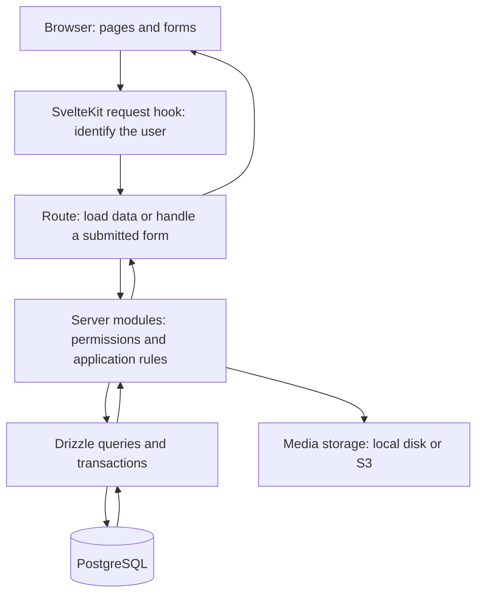

**Learning My Kitchen — a guide for someone who knows functions and basic web development.**

This guide follows the source in this checkout on September 13, 2026. It explains the application, its database, the path from a click to a saved change, and a practical study schedule. The database descriptions come from the schema and application code; they do not establish which migrations a running installation has applied.

**Start with one action: add an ingredient to the pantry.** Your first goal is to explain where that input goes and why it produces several database records. You can become familiar with the repository without memorizing every file.

The checkout contains about 21,000 lines across 144 non-test TypeScript, Svelte, and CSS source files. The application schema defines 28 tables, and Better Auth defines four more. That is enough code to justify learning it in small pieces over several weeks.

The app combines a personal recipe collection with a household inventory system. Its main product cycle is: save recipes → plan meals → calculate groceries → record purchases → cook → update pantry quantities and history. Calendar planning is optional; recipes can go directly into a grocery list or cooking mode.

**One SvelteKit application serves both the interface and the backend.**

| Technology          | Its job in this repository                                                                                      |
| ------------------- | --------------------------------------------------------------------------------------------------------------- |
| Svelte 5            | Defines pages and reusable interface components.                                                                |
| SvelteKit 2         | Maps URLs to files, loads page data, handles form submissions and HTTP endpoints, and renders pages.            |
| TypeScript          | Describes data shapes and catches certain mistakes before the app runs.                                         |
| Tailwind CSS        | Provides styling utilities; shared visual rules also live in the route stylesheet.                              |
| Node.js             | Runs the application server. The Docker image uses Node 24.                                                     |
| PostgreSQL          | Stores persistent structured data: accounts, recipes, stock, lists, and history.                                |
| Drizzle ORM         | Lets TypeScript code describe tables and construct SQL queries. PostgreSQL still stores and validates the data. |
| Better Auth         | Manages accounts, password/social sign-in, and database-backed sessions.                                        |
| Zod                 | Validates configuration and selected input structures at runtime.                                               |
| Vitest / Playwright | Test functions and database behavior / test the app through a browser.                                          |

Exact dependency declarations and commands are in [package.json](/Users/berkekara/repo/my-kitchen/package.json).



**The folders separate responsibilities; a feature usually crosses several of them.** The numbered rows below correspond to the broad sections in the existing [sections.md](/Users/berkekara/repo/my-kitchen/sections.md). That file is primarily a refactoring map. Use this guide's study order for learning.

| Section                             | What it does                                                                                                                                                                  | Where to look                                                                                                                                                                                                                                                                                |
| ----------------------------------- | ----------------------------------------------------------------------------------------------------------------------------------------------------------------------------- | -------------------------------------------------------------------------------------------------------------------------------------------------------------------------------------------------------------------------------------------------------------------------------------------- |
| 1. Request lifecycle and app shell  | Identifies the current user, loads household context, applies response policy, and provides shared navigation and page layout.                                                | [hooks.server.ts](/Users/berkekara/repo/my-kitchen/src/hooks.server.ts), [root layout](/Users/berkekara/repo/my-kitchen/src/routes/+layout.svelte), [AppShell](/Users/berkekara/repo/my-kitchen/src/lib/components/AppShell.svelte)                                                          |
| 2. Database                         | Defines tables, relationships, indexes, constraints, and the shared database connection pool.                                                                                 | [schema.ts](/Users/berkekara/repo/my-kitchen/src/lib/server/db/schema.ts), [db/index.ts](/Users/berkekara/repo/my-kitchen/src/lib/server/db/index.ts), [auth schema](/Users/berkekara/repo/my-kitchen/src/lib/server/db/auth.schema.ts)                                                      |
| 3. Accounts, households, and access | Sign-in, registration policy, first admin account, membership, invitations, owner/member permissions, settings, errors, and configuration.                                    | [auth.ts](/Users/berkekara/repo/my-kitchen/src/lib/server/auth.ts), [access.ts](/Users/berkekara/repo/my-kitchen/src/lib/server/access.ts), [households.ts](/Users/berkekara/repo/my-kitchen/src/lib/server/households.ts), [env.ts](/Users/berkekara/repo/my-kitchen/src/lib/server/env.ts) |
| 4. Inventory infrastructure         | Makes related writes atomic, prevents duplicate stock operations, locks rows, records events and quantity changes, and implements undo.                                       | [operations.ts](/Users/berkekara/repo/my-kitchen/src/lib/server/operations.ts), [inventory.ts](/Users/berkekara/repo/my-kitchen/src/lib/server/inventory.ts), [undo.ts](/Users/berkekara/repo/my-kitchen/src/lib/server/undo.ts)                                                             |
| 5. Pantry and cooking               | Displays stock by ingredient and lot, handles additions/corrections/waste, proposes cooking deductions, and records the confirmed deductions.                                 | [pantry.ts](/Users/berkekara/repo/my-kitchen/src/lib/server/pantry.ts), [cooking.ts](/Users/berkekara/repo/my-kitchen/src/lib/server/cooking.ts), [pantry route](</Users/berkekara/repo/my-kitchen/src/routes/(app)/pantry/+page.server.ts>)                                                 |
| 6. Groceries and meal plan          | Stores weekly meals, copies recipe requirements into grocery batches, calculates missing amounts, manages shopping states, and credits purchases.                             | [grocery.ts](/Users/berkekara/repo/my-kitchen/src/lib/server/grocery.ts), [plan.ts](/Users/berkekara/repo/my-kitchen/src/lib/server/plan.ts), [grocery-math.ts](/Users/berkekara/repo/my-kitchen/src/lib/shared/grocery-math.ts)                                                             |
| 7. Recipes and import               | Creates, reads, edits, duplicates, shares, favorites, prints, and exports recipes. Parses imported HTML, URLs, and PDFs for review before saving.                             | [recipes.ts](/Users/berkekara/repo/my-kitchen/src/lib/server/recipes.ts), [recipe-form.ts](/Users/berkekara/repo/my-kitchen/src/lib/server/recipe-form.ts), [import route](</Users/berkekara/repo/my-kitchen/src/routes/(app)/recipes/import/+page.server.ts>)                               |
| 8. Ingredients and barcode          | Connects recipe wording to ingredient identities, offers autocomplete and matching, and converts a scanned barcode into editable product suggestions.                         | [ingredients.ts](/Users/berkekara/repo/my-kitchen/src/lib/server/ingredients.ts), [ingredient-links.ts](/Users/berkekara/repo/my-kitchen/src/lib/server/ingredient-links.ts), [barcode lookup](/Users/berkekara/repo/my-kitchen/src/lib/server/barcode/lookup.ts)                            |
| 9. Media                            | Processes recipe photos, preserves imported source files, stores their bytes, and checks permission before serving them.                                                      | [media folder](/Users/berkekara/repo/my-kitchen/src/lib/server/media), [image pipeline](/Users/berkekara/repo/my-kitchen/src/lib/server/media/image-pipeline.ts), [storage.ts](/Users/berkekara/repo/my-kitchen/src/lib/server/media/storage.ts)                                             |
| 10. Shared and browser logic        | Shared: quantities, units, scaling, parsing, ingredient names, and grocery math. Browser: formatting, camera decoding, image resizing, toasts, and local display preferences. | [shared](/Users/berkekara/repo/my-kitchen/src/lib/shared), [client](/Users/berkekara/repo/my-kitchen/src/lib/client)                                                                                                                                                                         |
| 11. Screens and components          | Screens assemble features; components reuse forms, cards, scanners, alerts, dialogs, and refresh behavior.                                                                    | [routes](/Users/berkekara/repo/my-kitchen/src/routes), [components](/Users/berkekara/repo/my-kitchen/src/lib/components)                                                                                                                                                                     |
| 12. Tests, scripts, and deployment  | Verifies behavior, applies migrations, checks data consistency, measures performance, and builds/runs the deployed application.                                               | [tests](/Users/berkekara/repo/my-kitchen/tests), [scripts](/Users/berkekara/repo/my-kitchen/scripts), [Dockerfile](/Users/berkekara/repo/my-kitchen/Dockerfile), [compose.yaml](/Users/berkekara/repo/my-kitchen/compose.yaml)                                                               |

Within the routes, the main screens are `/recipes`, `/pantry`, `/pantry/history`, `/grocery`, `/grocery/lists`, `/plan`, `/household`, and `/settings`. Ingredient-link maintenance lives under `/settings/ingredient-links`. Authentication uses `/login`, `/register`, `/logout`, and `/invite/[token]`.

The smaller `/api/...` routes support barcode lookup, ingredient suggestions/matching, pantry-lot selection, and revision polling. `/media/...` serves authorized files. `/health` supports operational checks. Recipe print and JSON export URLs return alternate representations of recipes.

**Learn the SvelteKit filename conventions before reading entire pages.**

| Convention           | Meaning                                                                                                        |
| -------------------- | -------------------------------------------------------------------------------------------------------------- |
| `+page.svelte`       | The page interface. It can render on the server initially, then respond to interaction in the browser.         |
| `+page.server.ts`    | Server-only page data loading and form actions. `load` reads data for the page; `actions` handles submissions. |
| `+server.ts`         | An HTTP endpoint exporting handlers such as `GET` or `POST`.                                                   |
| `+layout.svelte`     | A surrounding interface shared by child pages.                                                                 |
| `+layout.server.ts`  | Server-loaded data or guards shared by child routes.                                                           |
| `(app)` and `(auth)` | Route groups for organization/layouts; their names do not appear in the URL.                                   |
| `[id=uuid]`          | A dynamic URL value checked by the project's UUID route matcher.                                               |
| `$lib/...`           | An import alias for the project's `src/lib` folder.                                                            |
| `$props()`           | Inputs passed into a component, including loaded page data.                                                    |
| `$state(...)`        | Reactive component state, such as whether a dialog is open.                                                    |
| `$derived(...)`      | A value computed from reactive inputs.                                                                         |

Read the official [routing guide](https://svelte.dev/docs/kit/routing) and [form actions guide](https://svelte.dev/docs/kit/form-actions) alongside the pantry route. They explain the framework conventions used here.

**A page read and a page write take related but different paths.**

Opening the pantry sends a request through [hooks.server.ts](/Users/berkekara/repo/my-kitchen/src/hooks.server.ts). The hook resolves the Better Auth session and fills `event.locals` with the user, session, memberships, active household, and request ID. This is information for that request; it is not global state shared between users.

The pantry route's `loadImpl` checks that the user has a household and verifies membership in the database. It calls `getPantryOverview`, which joins stock lots to ingredients and groups the results for the interface. The returned `overview`, filters, revisions, and operation ID become page data.

To follow an **Add stock** submission, open these functions in this order:

1. [Pantry form](</Users/berkekara/repo/my-kitchen/src/routes/(app)/pantry/+page.svelte:337>): find its field names and the action selected when `sheet.mode` is `add`. The form includes a hidden operation ID.
2. [Pantry `actions.add`](</Users/berkekara/repo/my-kitchen/src/routes/(app)/pantry/+page.server.ts:67>): reads the form, parses the amount, identifies the user/household, and calls `addStock`.
3. [addStock](/Users/berkekara/repo/my-kitchen/src/lib/server/pantry.ts:277): validates the amount, unit, date, and ingredient, and describes the stock addition.
4. [runOperation](/Users/berkekara/repo/my-kitchen/src/lib/server/operations.ts:80): uses the operation ID and a fingerprint of the request to recognize retries, and runs the change in a transaction.
5. [Inventory helpers](/Users/berkekara/repo/my-kitchen/src/lib/server/inventory.ts:20): lock/update the household revision, insert the event, create a lot initially at zero, and apply its positive movement.
6. [Database schema](/Users/berkekara/repo/my-kitchen/src/lib/server/db/schema.ts:309): connect those writes to `stock_lot`, `operation`, `inventory_event`, and `inventory_movement`.
7. The action returns success or a form error. SvelteKit's enhanced form handling refreshes the submitting page's data. Other devices discover the household's changed revision through polling.

The shared [PollRevisions component](/Users/berkekara/repo/my-kitchen/src/lib/components/PollRevisions.svelte) checks `/api/revisions` by default every 20 seconds while the page is visible and online. Relevant counter changes trigger a data reload. A page reporting unsaved input shows a notice instead. This refresh behavior is implemented with polling.

**The database stores relationships, current balances, and the history behind those balances.**

Think of a table as a collection of records with a defined shape. A row is one record; a column is one field. A primary key identifies a row. A foreign key links a row to another table. For example, `stock_lot.ingredient_id` refers to `ingredient.id`, so a lot can say which ingredient it contains without copying the entire ingredient record.

A join combines related rows for a query. The pantry joins a stock lot to its ingredient to display the ingredient's name next to the lot's quantity. Indexes help PostgreSQL locate matching rows efficiently. Constraints enforce rules such as nonnegative stock quantities and allowed status values.

These are the complete table groups currently defined in the two schema files:

| Group             | Tables                                                                                              | Meaning                                                                                                                         |
| ----------------- | --------------------------------------------------------------------------------------------------- | ------------------------------------------------------------------------------------------------------------------------------- |
| Authentication    | `user`, `session`, `account`, `verification`                                                        | People, active sessions, authentication-provider/password records, and verification records used by the auth system.            |
| Household context | `household`, `household_member`, `household_invite`, `user_preference`                              | Shared kitchens, who belongs to them, invitations, and a user's active-household preference.                                    |
| Ingredients       | `ingredient`, `ingredient_alias`                                                                    | Ingredient identity, category, optional density, and alternate searchable names.                                                |
| Recipes           | `recipe`, `recipe_ingredient`, `recipe_step`, `recipe_share`, `recipe_favorite`                     | Recipe metadata, ordered ingredients/instructions, household visibility, and personal favorites.                                |
| Media metadata    | `image`, `recipe_attachment`                                                                        | Ownership, storage keys, dimensions/file details, and original import attachments. File bytes live outside PostgreSQL.          |
| Pantry            | `stock_lot`                                                                                         | One stock batch with quantity, unit, location, expiry date, and revision.                                                       |
| Retry tracking    | `operation`                                                                                         | A submitted operation ID, actor, request fingerprint, and saved result.                                                         |
| Grocery planning  | `grocery_list`, `grocery_batch`, `grocery_batch_requirement`, `grocery_line`, `grocery_line_source` | Trip state; planned recipe servings; copied ingredient requirements; shopping items; and the batches contributing to each item. |
| Inventory history | `inventory_event`, `inventory_movement`, `purchase_allocation`                                      | What happened; each signed quantity change; and how a purchase was credited to a grocery line.                                  |
| Calendar planning | `meal_plan_entry`                                                                                   | A day with a linked recipe or a free-text meal note.                                                                            |
| Barcode           | `barcode_product`, `barcode_product_nutrient`, `barcode_miss`, `barcode_link`                       | Provider metadata/nutrients, cached misses, and household-confirmed ingredient/package mappings.                                |

A person can belong to several households, and a household can contain several people. `household_member` connects them. A recipe has several ingredient rows and steps. An ingredient can appear in many recipes and many pantry lots. One inventory event can produce several movements, such as cooking with several ingredients.

An ingredient identity and a recipe ingredient line have different jobs. “Rice” identifies a food for stock matching; “200 g rice, rinsed” is wording and quantity in one recipe. A recipe line can have an unknown amount or no ingredient identity, so it can remain readable without being fully usable in inventory calculations.

**Ownership is a central rule.** Recipes belong to their author; pantry lots, grocery lists, meal-plan entries, and saved barcode links belong to a household. Shared catalog ingredients have a null owner; custom ingredient identities have a user owner. Recipe access follows ownership or household sharing.

The current `createRecipe` implementation automatically shares a new recipe with its author's active household. The owner can subsequently unshare it, and editing does not automatically share it again. See [createRecipe and shareWithActiveHousehold](/Users/berkekara/repo/my-kitchen/src/lib/server/recipes.ts:476) and [the sharing tests](/Users/berkekara/repo/my-kitchen/tests/integration/recipes.test.ts:325). The README and design notes' “private unless shared” wording misses this creation default.

**A pantry lot is a batch, not a total for an ingredient.** Two bags of rice bought on different days may be separate lots, even though the interface groups them under Rice.

For a single example lot:

| Action                          | Movement written | Current lot quantity |
| ------------------------------- | ---------------- | -------------------- |
| Add a 1 kg bag, stored in grams | `+1000 g`        | `1000 g`             |
| Cook using 200 g                | `-200 g`         | `800 g`              |
| Undo that cooking event         | `+200 g`         | `1000 g`             |

`stock_lot.quantity` is the current balance used for fast reads. `inventory_movement` records its changes, while `inventory_event` explains who did what and why. Undo adds a compensating event and movements; it does not erase the original history. Undoing an addition can be refused if its stock has already been consumed and reversing it would create a negative quantity.

A transaction makes a group of database changes succeed or fail together. For example, a successful stock addition must have a consistent lot balance, event, movement, and operation result. [withTransaction](/Users/berkekara/repo/my-kitchen/src/lib/server/operations.ts:45) provides bounded retries for specific database concurrency failures. [Drizzle's transaction documentation](https://orm.drizzle.team/docs/transactions) explains the underlying API.

The inventory write paths also use row locks and revision checks. A lock coordinates concurrent changes; an expected revision detects that a user is acting on an older view. Membership checks answer whether the caller may perform the action at all. These solve different problems.

The operation ID makes a retry of the same stock request return its previous result without adding stock again. Reusing that ID with different input is rejected. Operation records are cleaned up after 30 days. This mechanism applies to operations using `runOperation`; some other writes, such as recipe creation and meal-plan changes, use transactions without that wrapper.

Quantities use the project's [Dec type](/Users/berkekara/repo/my-kitchen/src/lib/shared/decimal.ts), backed by fixed-point integer arithmetic with six decimal places. Database quantity columns use `numeric(14,6)`, and quantities are serialized as strings. `null` means unknown; it does not mean zero. Mass and volume conversions require different handling; an ingredient-specific density is needed where the application permits conversion between them. Changing display units does not rewrite stored quantities.

The read-only [consistency checker](/Users/berkekara/repo/my-kitchen/scripts/consistency-check.mjs) compares lot quantities with the sum of their movements and grocery purchase totals with the sum of their allocations. It shows you two important invariants to preserve when changing inventory code.

**The grocery workflow explains much of the application's complexity.**

1. Save a recipe with base servings and ingredient requirements. A calendar entry can point at it, or you can add it directly to a grocery draft.
2. Add a recipe batch to the draft: a planned amount of that recipe, with copied requirements and a recipe revision. Sending a week to groceries adds its recipe entries at base servings and skips free-text notes.
3. Scale and combine the recipe requirements, then subtract matching pantry stock once. Two recipes needing 500 g and 300 g of the same ingredient require 800 g total; with 300 g in the pantry, the suggested purchase is 500 g. This example is covered by [grocery-math.test.ts](/Users/berkekara/repo/my-kitchen/src/lib/shared/grocery-math.test.ts:26).
4. Starting shopping checks whether the list, pantry, or recipes changed since the preview. If necessary, it asks you to review an updated preview. A successful transition keeps the purchase targets stable during the trip.
5. Recording a purchase adds the full bought quantity to the pantry and credits the grocery line. Remaining demand is `max(0, target - credited purchases)`. It does not subtract pantry stock a second time.
6. Completing or reopening the trip changes its shopping status; it does not add or remove stock.
7. Cooking shows proposed lot deductions for review. Finishing records the chosen deductions, checks revisions and availability, and can record how much of a planned batch was fulfilled.

The list states are `draft → shopping → completed`, with reopening back to `shopping`. A calendar entry, a grocery batch, a purchased item, and a completed cooking event are separate records. Planning a meal does not itself move pantry stock. Separate grocery lists do not reserve stock from one another.

Read the relevant functions in [grocery.ts](/Users/berkekara/repo/my-kitchen/src/lib/server/grocery.ts) individually: `recalculateDraft`, `addBatch`, `startShopping`, `recordPurchase`, and `completeList`. At roughly 1,300 lines, this is a later study target after the pantry example and pure grocery math.

**Importing and scanning feed the same recipe and inventory systems.**

Recipe import follows input → parsing → ingredient-match proposals → an editable review form → save recipe → link its preserved source attachment. URL input is fetched on the server. HTML/PDF files may be parsed in the browser, with server validation/fallback. PDF text extraction is implemented; a scanned PDF with no extractable text can be retained as a source, but there is no OCR step in this path. Read [the import action](</Users/berkekara/repo/my-kitchen/src/routes/(app)/recipes/import/+page.server.ts>) before the individual parsers.

Barcode scanning follows camera/manual digits → canonical GTIN validation → lookup/cache/provider metadata → editable suggestion → confirmed stock addition. USDA and Open Food Facts are optional metadata sources. Household-confirmed values take precedence in [suggestionFor](/Users/berkekara/repo/my-kitchen/src/lib/server/barcode/suggest.ts:54). The lookup may still consult provider metadata even when a household link exists; saved-value precedence does not mean every known barcode avoids provider work. Looking up a barcode can update caches but does not add stock. Confirmation calls the pantry write path and saves the household link with the stock addition.

Photos and attachments have database metadata but their bytes use local storage or S3. Media URLs check access before serving data. The startup hook bootstraps the configured admin account and starts cleanup of old unreferenced media, operation records, and barcode cache data.

**There are three separate workflows for changing, testing, and deploying the app.**

During local development, `pnpm dev` runs the development server, normally on port 5173. [compose.dev.yaml](/Users/berkekara/repo/my-kitchen/compose.dev.yaml) provides PostgreSQL for development on local port 5433, with the `recipe_dev` database. Your checkout already has environment files; keep them. When setting up development, compare settings against [.env.example](/Users/berkekara/repo/my-kitchen/.env.example) and establish that the database URL points to your development database before running database-changing commands.

The [connection module](/Users/berkekara/repo/my-kitchen/src/lib/server/db/index.ts) creates one bounded Postgres.js connection pool per server process and passes it to Drizzle. A pool reuses connections across requests. `DATABASE_URL` selects the database; `db` is the query interface; `tx` is that interface inside a particular transaction.

Editing a TypeScript table definition does not modify an existing database. A schema change follows this sequence: edit the schema → generate a migration with `pnpm db:generate` → inspect the generated SQL → apply it to development with `pnpm db:migrate` → migrate the test database and test the behavior. [scripts/migrate.mjs](/Users/berkekara/repo/my-kitchen/scripts/migrate.mjs) applies committed migration files and records applied migrations in `drizzle.__drizzle_migrations`; it uses a database advisory lock to coordinate concurrent migration runners. Generated migration files are not a good place to begin learning.

For deployment, [Dockerfile](/Users/berkekara/repo/my-kitchen/Dockerfile) installs dependencies, builds the SvelteKit application, removes development-only dependencies from the runtime dependency tree, and packages the Node server. [compose.yaml](/Users/berkekara/repo/my-kitchen/compose.yaml) starts PostgreSQL, waits for it to become healthy, runs the migration service, then starts the app after migrations succeed. The app listens inside the container on port 3000; the default host port is 3003. Optional Cloudflare containers provide tunnel access.

Production Compose keeps database data in its `pgdata` volume and local media in `uploads`. Rebuilding application code does not itself replace these volumes. A cloud-database variant is supplied in [compose.cloud-db.yaml](/Users/berkekara/repo/my-kitchen/compose.cloud-db.yaml); it uses an external PostgreSQL URL. See [deployment.md](/Users/berkekara/repo/my-kitchen/docs/deployment.md) for deployment and backup procedures.

No GitHub Actions workflow directory was present in this checkout. The Docker build runs the application build, but does not run the repository's type, lint, or test commands. Treat validation and deployment as separate steps.

| Check                        | What it tells you                                         | Command                                  |
| ---------------------------- | --------------------------------------------------------- | ---------------------------------------- |
| Types and Svelte diagnostics | Whether the typed code and component checks succeed       | `pnpm check`                             |
| Formatting and lint          | Whether the code follows the configured rules             | `pnpm lint`                              |
| Unit tests                   | Whether isolated logic behaves as expected                | `pnpm test:unit`                         |
| Integration tests            | Whether application operations work with PostgreSQL       | `pnpm test:integration`                  |
| Browser tests                | Whether complete browser flows work against the built app | `pnpm build` followed by `pnpm test:e2e` |
| Data consistency             | Whether stored balances match recorded movements/credits  | `pnpm db:check`                          |

Integration tests require a disposable `recipe_test` database; their helpers delete test records between cases. Do not point them at data you want to keep. Browser tests also use the test environment and the built app on port 4173. `pnpm test` includes unit and integration tests, but does not include browser tests. The repository's complete-change checklist calls for type checks, lint, and unit/integration tests, with browser checks relevant to the changed flow.

**Use a four-week first pass, then deepen the parts you change.** These are planning estimates for someone with your stated background, at five focused one-hour sessions per week.

| Milestone                                             | Cumulative focused time        | What you should be able to do                                                                                                    |
| ----------------------------------------------------- | ------------------------------ | -------------------------------------------------------------------------------------------------------------------------------- |
| Initial orientation                                   | 3–5 hours                      | Find the main folders and explain the role of SvelteKit, the server modules, and PostgreSQL.                                     |
| Repository familiarity                                | 20–30 hours, around 4–6 weeks  | Trace common features, identify the relevant tables/tests, and explain shopping, cooking, and undo.                              |
| Confidence making small changes                       | 40–60 hours, around 8–12 weeks | Make a scoped change, predict its effects, add meaningful verification, and review the diff yourself.                            |
| Independent work on concurrency, auth, and operations | 80–120+ hours                  | Reason about competing requests, access boundaries, migration/deployment behavior, and failures. This develops through practice. |

Your first four weeks can look like this:

| Week                       | Read and practice                                                                                                                                          | Check your understanding                                                                                                 |
| -------------------------- | ---------------------------------------------------------------------------------------------------------------------------------------------------------- | ------------------------------------------------------------------------------------------------------------------------ |
| 1: Pages and requests      | Tour the interface; read the folder map and SvelteKit conventions; follow the pantry page load; trace `actions.add` to `addStock`.                         | Explain the difference between `load`, a form action, and a domain function. Identify where the current user comes from. |
| 2: Data and quantities     | Read the household, ingredient, stock, event, and movement tables; follow `createLot`/`applyMovement`; study decimal, scaling, and grocery-math tests.     | Draw the records for adding 1 kg, using 200 g, and undoing the cooking. Explain unknown versus zero.                     |
| 3: Product workflows       | Follow recipe creation, automatic sharing, grocery draft calculation, shopping, purchase crediting, cooking, and undo. Read one integration test per flow. | Predict what changes in the database at each click and explain why completing shopping moves no stock.                   |
| 4: Practice and operations | Review revision polling, config, migrations, deployment, and the three test layers. Make one tiny change in a development branch and inspect it.           | Find the right files without assistance and explain the change's input, output, permissions, and verification.           |

For each hour: spend 10 minutes choosing one behavior and predicting its path, 25 minutes following it in code, 15 minutes with an existing test or small development experiment, and 10 minutes writing an explanation in your own words. Keep a short list of unknown terms and resolve only the ones blocking that day's feature.

Your first session can be concrete:

1. Spend 10 minutes reading this map and locating the pantry screen and its server file.
2. Spend 15 minutes following the pantry `loadImpl` to `getPantryOverview`. List the data sent to the page.
3. Spend 20 minutes following only `actions.add → addStock → runOperation → createLot → applyMovement`.
4. Spend 10 minutes reading one grocery-math test and predicting its expected values before revealing them.
5. Spend 5 minutes explaining aloud: “What happens when I add 1 kg of rice?” Mark where you still need help.

For a first coding exercise, change a pantry helper message and inspect it in the development app. Then try a more meaningful learning exercise: add a quantity/scaling test with expected results you computed yourself. Save changes to stock mutation behavior until you can explain transactions, history, and duplicate-request protection.

Use the existing tests as worked examples: [grocery arithmetic](/Users/berkekara/repo/my-kitchen/src/lib/shared/grocery-math.test.ts), [grocery database flow](/Users/berkekara/repo/my-kitchen/tests/integration/grocery-flow.test.ts), [cooking and undo](/Users/berkekara/repo/my-kitchen/tests/integration/cooking-undo.test.ts), and [shopping in a browser](/Users/berkekara/repo/my-kitchen/tests/e2e/shopping.spec.ts). For SQL fundamentals, use the [PostgreSQL 17 tutorial](https://www.postgresql.org/docs/17/tutorial.html), focusing first on querying tables, joins, foreign keys, and transactions.

The first example tests can run without a database:

```sh
cd /Users/berkekara/repo/my-kitchen
pnpm exec vitest run --project unit src/lib/shared/grocery-math.test.ts src/lib/shared/scaling.test.ts src/lib/shared/decimal.test.ts
```

That exact command passed all 28 tests across its three files during this walkthrough. The integration/browser suites, live database contents, and deployment were not exercised for this guide.

**Make explanation a requirement for future AI-assisted changes.** A useful request is: “Explain the current behavior and relevant test first. Propose one small change, identify its database effects, and wait while I explain the result back.” Before accepting code, be able to name the changed files, the behavior they implement, the records they affect, and the test that would catch a mistake.

You are familiar with this repository when you can trace a feature, find its data model, predict an edge case, and verify a small change. Being able to locate and explain the right code is the goal; recalling every implementation detail is unnecessary.
